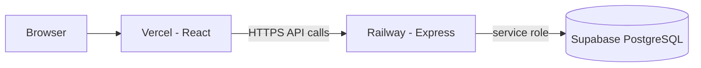

# Deployment guide — Railway (backend) + Vercel (frontend)

This guide walks you through making the **production** app fully functional end-to-end.

## Architecture



- **Frontend** never talks to Supabase directly (keeps DB credentials on the server).
- **Backend** uses the Supabase **service role** key (server-only secret).

---

## Step 1 — Supabase database

1. Sign in at [supabase.com](https://supabase.com) → **New project**.
2. Wait for the database to finish provisioning.
3. Open **SQL Editor** → **New query**.
4. Copy the full contents of `supabase/schema.sql` from this repo → **Run**.
5. Confirm the table exists: **Table Editor** → you should see `tasks`.

### Get API credentials

**Project Settings** → **API**:

| Copy this | Used on |
|-----------|---------|
| Project URL | Railway `SUPABASE_URL` |
| `service_role` (secret) | Railway `SUPABASE_SERVICE_ROLE_KEY` |

Never put the service role key in the frontend or commit it to Git.

---

## Step 2 — Push code to GitHub

```bash
cd full-stack-deployment
git init
git add .
git commit -m "Task manager: React frontend, Express backend, Supabase"
git branch -M main
git remote add origin https://github.com/YOUR_USER/YOUR_REPO.git
git push -u origin main
```

---

## Step 3 — Deploy backend on Railway

### 3.1 Create project

1. Go to [railway.app](https://railway.app) and sign in (GitHub is easiest).
2. **New Project** → **Deploy from GitHub repo**.
3. Select the repository you just pushed.

### 3.2 Point Railway at the backend folder

Railway may try to deploy the repo root. For a monorepo you must set the service root:

1. Click your **service** (the deployed box).
2. **Settings** tab.
3. **Root Directory** → enter: `backend`
4. Save. Railway will redeploy.

### 3.3 Environment variables

Open the **Variables** tab and add:

| Name | Example / notes |
|------|------------------|
| `SUPABASE_URL` | `https://abcdefgh.supabase.co` |
| `SUPABASE_SERVICE_ROLE_KEY` | long JWT from Supabase (service_role) |
| `NODE_ENV` | `production` |
| `FRONTEND_URL` | Leave empty for now, or use `http://localhost:5173` while testing |

Do **not** set `PORT` — Railway injects it automatically.

### 3.4 Public URL

1. **Settings** → **Networking** → **Generate Domain** (or **Public Networking** → enable).
2. Copy the URL, e.g. `https://task-manager-api-production.up.railway.app`.

### 3.5 Verify the API

In a browser or terminal:

```bash
curl https://YOUR-RAILWAY-DOMAIN.up.railway.app/api/health
```

Expected:

```json
{"status":"ok","timestamp":"..."}
```

Test create (optional):

```bash
curl -X POST https://YOUR-RAILWAY-DOMAIN.up.railway.app/api/tasks \
  -H "Content-Type: application/json" \
  -d "{\"title\":\"Deploy test\",\"description\":\"From curl\"}"
```

If you get 500 errors, open **Deployments** → latest deploy → **View Logs**. Usually missing/wrong Supabase variables or schema not applied.

### 3.6 Common Railway issues

| Problem | Fix |
|---------|-----|
| Build fails “no package.json” | Set **Root Directory** to `backend` |
| App crashes on start | Check logs; verify `SUPABASE_*` vars |
| 502 Bad Gateway | Wait for deploy; confirm `npm start` runs (`node src/index.js`) |
| CORS error from browser | See **CORS troubleshooting** below |

### CORS troubleshooting (production)

The browser sends an `Origin` header that must **exactly** match `FRONTEND_URL` on Railway.

1. Open your **live Vercel site** in the browser (not Railway).
2. Copy the URL from the address bar, e.g. `https://full-stack-deployment.vercel.app`
   - Must be `https`
   - **No** trailing `/`
   - Include `www` only if Vercel uses it (usually it does not)
3. Railway → **Variables** → set:
   ```
   FRONTEND_URL=https://full-stack-deployment.vercel.app
   ```
4. Redeploy Railway (variable changes trigger redeploy).
5. Check: open `https://YOUR-RAILWAY-URL/api/health` — `cors.allowedOrigins` should list your Vercel URL.

**Preview deployments** (URLs like `https://project-abc123.vercel.app`):

Either add each URL to `FRONTEND_URL` (comma-separated), or set:

```
ALLOW_VERCEL_PREVIEWS=true
```

**Still failing?** In DevTools → Network → failed request → compare **Request URL** (API) with `VITE_API_URL` on Vercel (no trailing slash, must be Railway HTTPS URL).

---

## Step 4 — Deploy frontend on Vercel

1. [vercel.com](https://vercel.com) → **Add New** → **Project** → import the same GitHub repo.
2. **Root Directory**: click **Edit** → set to `frontend`.
3. Framework should auto-detect **Vite**.
4. **Environment Variables**:
   - Name: `VITE_API_URL`
   - Value: your Railway URL **with no trailing slash**  
     e.g. `https://task-manager-api-production.up.railway.app`
5. **Deploy**.

After deploy, copy your Vercel URL, e.g. `https://task-manager-xyz.vercel.app`.

---

## Step 5 — Connect frontend and backend (CORS)

1. In Railway **Variables**, set:

   ```
   FRONTEND_URL=https://task-manager-xyz.vercel.app
   ```

   Use your real Vercel URL. No trailing slash. Must be `https` in production.

2. Railway redeploys automatically when variables change.

3. Open the Vercel site → add a task → it should persist in Supabase (**Table Editor** → `tasks`).

---

## Step 6 — Local development (optional)

**Backend** (`backend/.env`):

```env
PORT=5000
SUPABASE_URL=https://xxx.supabase.co
SUPABASE_SERVICE_ROLE_KEY=your_service_role_key
FRONTEND_URL=http://localhost:5173
```

```bash
cd backend && npm install && npm run dev
```

**Frontend** (`frontend/.env`):

```env
VITE_API_URL=http://localhost:5000
```

```bash
cd frontend && npm install && npm run dev
```

---

## Checklist for a working production site

- [ ] `schema.sql` executed in Supabase
- [ ] Railway root directory = `backend`
- [ ] `SUPABASE_URL` and `SUPABASE_SERVICE_ROLE_KEY` set on Railway
- [ ] Railway public domain works (`/api/health`)
- [ ] Vercel root directory = `frontend`
- [ ] `VITE_API_URL` = Railway URL on Vercel
- [ ] `FRONTEND_URL` = Vercel URL on Railway
- [ ] Create / edit / delete / complete tasks work in the browser

---

## Security notes

- Only the **backend** holds the Supabase service role key.
- Rotate keys in Supabase if they were ever committed.
- For a public app with auth later, add Supabase Auth + RLS policies; this starter uses server-side access only.
